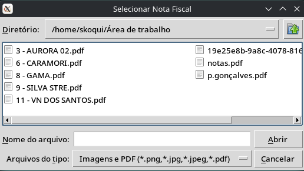
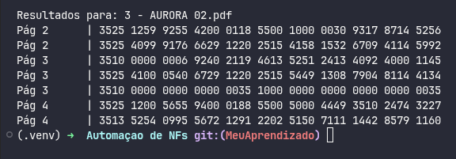

# 🚀 Automação de Extração de Chaves NF-e (SP)

Este projeto foi desenvolvido para automatizar e agilizar o processo de extração de **Chaves de Acesso de Notas Fiscais Eletrônicas (NF-e)**. O programa identifica automaticamente sequências de 44 dígitos iniciadas por **35** (Estado de São Paulo) em arquivos PDF e imagens (PNG/JPG), aplicando uma formatação padronizada para facilitar a conferência.

## 🛠️ Funcionalidades

- **Multi-formato:** Lê arquivos `.pdf`, `.png`, `.jpg` e `.jpeg`.
- **Híbrido:** Funciona em Linux e Windows.
- **Extração Inteligente:** Limpa automaticamente caracteres especiais, pontos e traços.
- **Seleção Visual:** Abre uma janela do sistema para você escolher o arquivo sem precisar mexer no código.
- **Formatação Automática:** Entrega a chave pronta: `35XX XXXX XXXX XXXX XXXX XXXX XXXX XXXX XXXX XXXX XXXX`.

---


---

## 📋 Pré-requisitos (Dependências do Sistema)

O Python utiliza motores externos para "ler" as imagens e PDFs. Você precisa instalá-los:

### 🐧 No Linux (Ubuntu/Debian)

Abra o terminal e execute:
```bash
sudo apt update
sudo apt install tesseract-ocr tesseract-ocr-por poppler-utils
```

### 🪟 No Windows

1. **Tesseract OCR:** Baixe e instale o executável de [UB-Mannheim](https://www.google.com/search?q=https://github.com/UB-Mannheim/tesseract/wiki).
2. **Poppler:** Baixe a versão mais recente em [Release Poppler Windows](https://github.com/oschwartz10612/poppler-windows/releases), extraia a pasta e coloque o caminho da pasta `bin` no script ou nas variáveis de ambiente.

---

## 🚀 Instalação e Uso

1. **Clone o repositório:**
```bash
git clone https://github.com/skoqui/Projetos.git
cd Projetos/Automacao-NF/
```

2. **Crie e ative um ambiente virtual:**

```bash
python3 -m venv .venv
source .venv/bin/activate  # Linux
 # .venv\Scripts\activate  # Windows
```

3. **Instale as dependências do Python:**
```bash
pip install -r requirements.txt
```
   
4. **Execute o programa:**
   
```bash
python app.py
```

---

## 📦 Como gerar o Executável (.exe) no Windows

Se você quiser distribuir o programa para quem não tem Python instalado:

1. Instale o PyInstaller: `pip install pyinstaller`
2. Gere o build:

```bash
pyinstaller --noconsole --onefile app.py
```

O arquivo final estará na pasta `dist/`.

---

## 📄 Licença

Este projeto está sob a licença MIT - sinta-se livre para usar e melhorar!