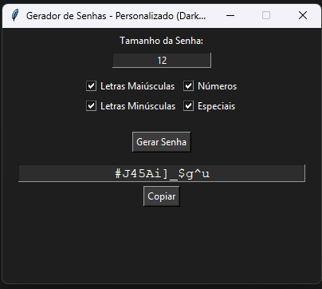

# Gerador de Senhas Seguras com Interface Gráfica (Tkinter)

Este é um programa simples para gerar senhas seguras com **interface gráfica**, desenvolvido em **Python**.  
Você pode escolher o tamanho da senha, incluir letras maiúsculas, minúsculas, números e símbolos, e copiar a senha com um clique.  
A interface é no **modo escuro**, para não cansar a vista.

> Repositório oficial: [github.com/skoqui/makepass](https://github.com/skoqui/makepass)

---

## Funcionalidades

- Interface gráfica fácil de usar
- Escolha do tamanho da senha
- Opções para incluir:
  - Letras maiúsculas
  - Letras minúsculas
  - Números
  - Caracteres especiais
- Botão para copiar a senha
- Modo escuro

---

## Interface



---

## Como Instalar e Usar

### 1️ - Baixar o programa
Baixe o arquivo ZIP ou clone o repositório:
```bash
git clone https://github.com/skoqui/makepass.git
cd makepass
```
Se não tiver Git, clique no botão **Code > Download ZIP** no GitHub e extraia a pasta.

---

### 2 - Usar diretamente (modo simples)
Se você já tem **Python instalado** (versão 3.8 ou superior):

1. Abra a pasta do programa no seu computador.  
2. Clique duas vezes no arquivo `gerador_senha.py` **OU** abra o terminal e digite:
```bash
python gerador_senha.py
```

---

## Como Criar um Arquivo Executável (para quem não quer instalar Python)

Se você quiser gerar um **arquivo executável** que funcione sem instalar nada, siga os passos:

### Instalar o PyInstaller
No Windows ou Linux, abra o terminal e digite:
```bash
pip install pyinstaller
```

---

### Criar Executável no **Windows**
No Windows, abra o **CMD** na pasta do programa e digite:
```bash
pyinstaller --onefile --noconsole gerador_senha.py
```
- O arquivo pronto estará na pasta:
```
dist/gerador_senha.exe
```
Você pode copiar esse `.exe` para qualquer computador com Windows e abrir normalmente.

---

### Criar Executável no **Linux**
No Linux, abra o terminal na pasta do programa e digite:
```bash
pyinstaller --onefile --noconsole gerador_senha.py
chmod +x dist/gerador_senha
```
- O arquivo estará na pasta:
```
dist/gerador_senha
```
Basta clicar nele ou rodar no terminal.

---

## Observações
- Windows e Linux precisam ser empacotados separadamente.
- Para colocar um ícone no programa, use:
```bash
pyinstaller --onefile --noconsole --icon=icone.ico gerador_senha.py
```
  - No Windows use `.ico`, no Linux `.png`.
- O Python pode ser baixado em: [https://www.python.org/downloads/](https://www.python.org/downloads/)

---
